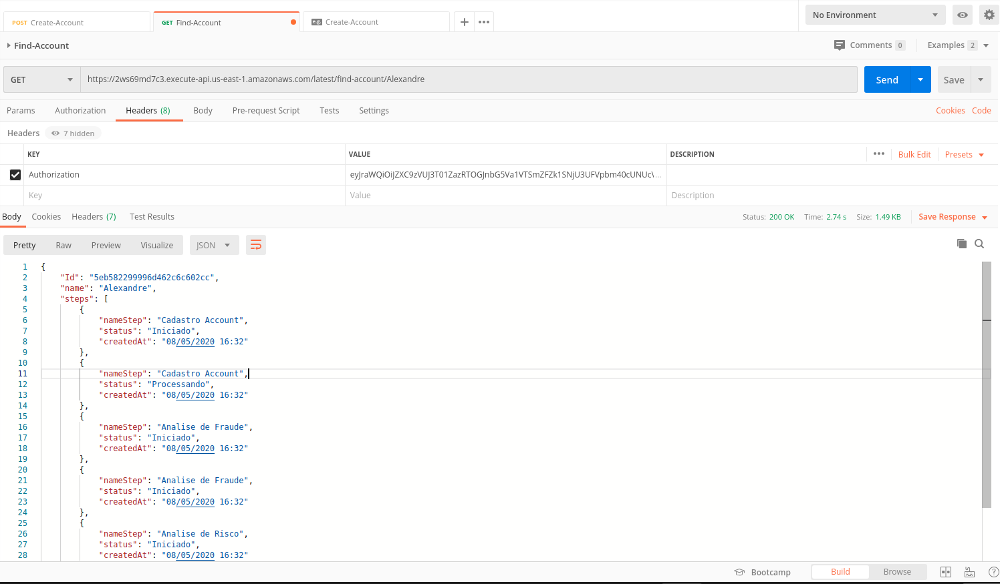

# ACCOUNT CREDIT

The project MSV-ACCOUNT-CREDIT was building as Serverless Application.
I used a concept os micro-services and Designer Driver Event this project:
 * Code Base: Java 8, SpringBoot(ProxyHandler) for Serverless
 * Authorizer: AWS Cognito
 * ApiGateway: AWS ApiGateway
 * OPS: CloudFormation, Maven
 * MongoDB: Atlas Cloud

##REQUIREMENT 
You need the following tools.

* SAM CLI - [Install the SAM CLI](https://docs.aws.amazon.com/serverless-application-model/latest/developerguide/serverless-sam-cli-install.html)
* Java8 - [Install the Java SE Development Kit 8](http://www.oracle.com/technetwork/java/javase/downloads/jdk8-downloads-2133151.html)
* Maven - [Install Maven](https://maven.apache.org/install.html)
* Docker - [Install Docker community edition](https://hub.docker.com/search/?type=edition&offering=community)
* AWS CLI - [Install AWS CLI](https://docs.aws.amazon.com/cli/latest/userguide/install-linux-al2017.html)

  You need configure a credential for aws cli (https://docs.aws.amazon.com/cli/latest/userguide/cli-configure-files.html)

## Deploy the application Cloud AWS

if you want publish in cloud aws following this steps:

check if you in the path of project msv-account-credit/AccountFunction
~~~
bash CloudFormation
bash MakeFile
~~~
 * bash CloudFormation - this creat all infrastructure same ApiGateway, Lambda, Cognito, Roles and other resources.
 
 * bash MakeFile - This will build project and publish Lambda in cloud.
 
 ##IF you dont have time to  deploy
 
 then access this url:
 
 Web for token: http://account-credit.s3-website-sa-east-1.amazonaws.com/
    you will need create a account and correct phone number for receive MFA with code validation how I do this fast
    pay attention for input phone number
 
 APIGateway: https://2ws69md7c3.execute-api.us-east-1.amazonaws.com/latest
 
 
 After this success process you need access console aws and see .
--- 
 The health of your stack publish
 
 

---
 For use url of API and ID for UserPoolID and ClientPoolUserID 
 
 
 
 ---
 With URL api you can access two operations:
 
 But before you need get git clone other project for get token Authorizer, and read README.md. You will need UserPollClientId and UserPoolid
   
  
  
  Click and copy this and add than to Header of Postman
   
   
   
 
~~~
 git clone git@github.com:AlexandreSosi/web-account-credit.git
~~~
 
 
 ~~~
 {$endpoint-api}/create-account
 ~~~

  
  
 ~~~
 {$endpoint-api}/find-account/{name}
 ~~~
  
  
### Take Download Postman Collection

Inside this collection have two methods show up.

  
[Download file](AccountFunction/docs/Account-Credit.postman_collection.json)

## Unit tests

A Test defined in the `AccountFunction/src/test` folder in this project.

```bash
AWS$ cd AccountFunction
AccountFunction mvn test
```

## Cleanup

To delete the sample application that you created, use the AWS CLI. Assuming you used your project name for the stack name, you can run the following:

```bash
aws cloudformation delete-stack --stack-name AWS
```
**Author**: _Alexandre Soares_